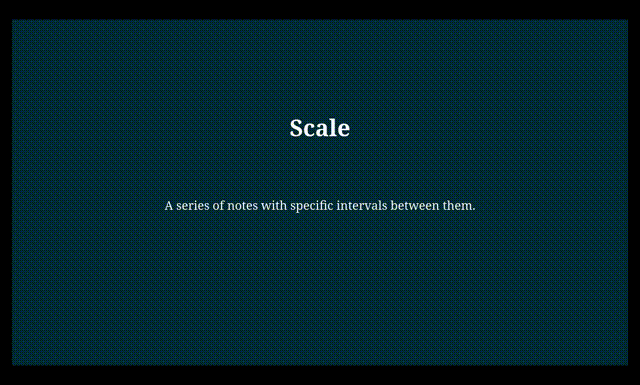

# Marpit Fragments Plugin

Make any part of your Markdown a fragment, and create click animations.

## Usage

After installing this plugin with your favorite package manager, add it in a custom engine, either inside your config file:
```js
// marp.config.mjs
import fragmentPlugin from "marpit-plugin-fragments"

export default {
  engine: ({ marp }) => marp.use(fragmentPlugin)
}
```

Or alternatively, in its own file:
```js
// enigne.js
import fragmentPlugin from "marpit-plugin-fragments"

export default ({ marp }) => marp.use(fragmentPlugin)
```

Now in your Markdown file, use a fragment block:
```md
# Scale

A series of notes with specific intervals between them. 

::: fragment
The way a musical piece uses them is called a **key**.
:::
```

And voila!



## Disclaimer

This plugin was "vibe-coded" using [duck.ai](https://duck.ai); however, I manually tested it and even made some bad changes that had to be reverted, so I do not consider this project "slop". Ultimately, your milage may vary.
